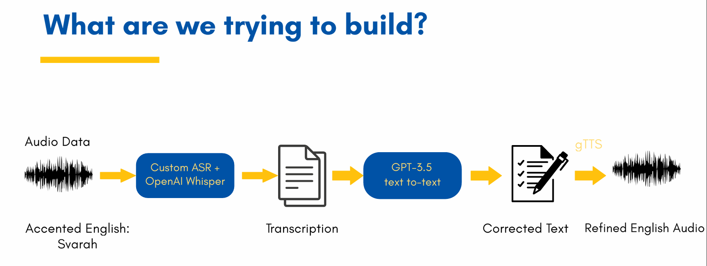

# English Improvement Coach for Indian-Accented Tones 🗣️🇮🇳

A real-time AI-based English coaching tool for Indian-accented speakers. This system takes user voice input, transcribes it using **OpenAI Whisper** and **HuBERT**, improves grammar with **GPT-3.5**, and plays back the corrected sentence using **Google Text-to-Speech** — creating a conversational loop via a **Gradio interface**.

---

## 🎯 Goal

Assist Indian English speakers in improving pronunciation and grammar in real-time by:
- Analyzing spoken input
- Generating corrected transcriptions
- Synthesizing native-like audio output

---

## 🧩 Key Technologies

| Component           | Tool Used                                                    |
|---------------------|-------------------------------------------------------------|
| ASR (Speech to Text)| OpenAI Whisper, HuBERT                                      |
| Grammar Correction  | GPT-3.5 via HuggingFace (`prithivida/grammar_error_correcter_v1`) |
| TTS (Text to Speech)| Google Cloud TTS (gTTS alternative)                         |
| UI                  | Gradio (for voice-to-voice interaction)                     |
| Evaluation          | Word Error Rate (WER) via `jiwer`                           |

---

## 🔁 How It Works

### 📌 Architecture Overview



The process flow is:

1. 🎙️ **Audio input** from Svarah (Indian-accented English)
2. 🔊 Transcribed via **Whisper + HuBERT**
3. ✍️ Text corrected using **GPT-3.5 grammar model**
4. 🔁 Converted back into native-style audio via **Google TTS**

---

## 📁 Dataset

We used the **Svarah** dataset — a high-quality Indian-accented English speech dataset featuring audio clips across diverse regional accents.

- 🔗 [Svarah on Hugging Face](https://huggingface.co/datasets/ai4bharat/Svarah)
- 📄 Citation available in the section below
- 💾 Format: `.wav` audio files
- 🧠 Suitable for ASR, pronunciation evaluation, and accent-specific NLP

---

## 🛠️ Code Highlights

```python
# Transcribe using Whisper and HuBERT
transcription_whisper = transcribe_whisper(audio_path)
transcription_hubert = transcribe_hubert(audio_path)

# Correct grammar using GPT-3.5 model
corrected_text = correct_text(transcription_whisper)

# Convert to native-sounding audio
text_to_speech(corrected_text, "output.mp3")

# Evaluate accuracy using Word Error Rate
accuracy = calculate_accuracy(ground_truth, corrected_text)
```

---

## 📊 Sample Output

```
Original:     so because when I have to make payment I do it by Apple Pay
Whisper:      So because when I have to make payment, I do it by April pay.
HuBERT:       SO BECAUSE WHEN I HAVE TO MAKE PAYMENT I DO IT BY A PULPET
Corrected Whisper: So when I have to make payment, I do it by April pay.
Corrected HuBERT:  When I have to make payment I do it by a pulpet.
Whisper Accuracy: 85.71%
HuBERT Accuracy:  71.43%
```

✔️ Outputs saved as:
- `whisper_output.mp3`
- `hubert_output.mp3`

---

## 🚧 Project Status & Vision

This project currently serves as a **working base prototype**. It runs locally and demonstrates the core functionality of:

- Transcribing Indian-accented speech
- Correcting grammar using an LLM
- Converting improved sentences to speech

### 🛠️ Development Status:
- The **voice-to-voice pipeline** works end-to-end locally.
- Not yet packaged as a full-fledged app or web service.
- Gradio integration is in progress for interactive demos.

### 🎯 Future Vision:
We aim to evolve this into an **accessible and user-friendly AI-powered application** that helps Indian English speakers across regions improve spoken English fluency, grammar, and pronunciation in real time — especially useful for learners, students, professionals, and second-language speakers.

> This tool is designed with inclusivity and practicality in mind — bridging tech with language learning.

---

## 🔮 Future Work

- Accent-specific fine-tuning of models (e.g., region-wise Svarah subsets)
- Add multilingual support (e.g., Hinglish, Tamil-English)
- Use Whisper Large + Tortoise TTS for better voice realism
- Deploy to Hugging Face Spaces or Streamlit Cloud for public demo

---

## 📚 Research Inspiration

This project was inspired by literature on inclusive ASR systems and the need for accent-aware AI tools. Key references include:
- *Evaluating Whisper ASR Across Accents* – University of Cambridge
- *Exploring Integrations of LLMs in ASR* – Peking University
- *Svarah Dataset Paper*
- *BERT and HuBERT papers on contextual embeddings for speech*
- *Speech Recognition Using Deep Neural Networks* – University of Sharjah

---

## 👨‍💻 Contributors

- **Roshan A Rauof** 
- **Amritha K** 
- **Reem Fariha** 
- **Shifana Mehar** 

---

## 📌 Tags

`#ASR` `#SpeechToText` `#IndianAccentAI` `#LLM` `#Whisper` `#gTTS` `#Gradio` `#XAI` `#GPT35`

---

## 📖 Citation

If you use any of the tools or datasets in this project, please consider citing the following resources:

---

### 📌 Svarah Dataset

**Paper:**  
[Svarah: Evaluating English ASR Systems on Indian Accents (INTERSPEECH 2023)](https://www.isca-archive.org/interspeech_2023/javed23_interspeech.pdf)

```bibtex
@inproceedings{DBLP:conf/interspeech/JavedJNSNRBKK23,
  author       = {Tahir Javed and
                  Sakshi Joshi and
                  Vignesh Nagarajan and
                  Sai Sundaresan and
                  Janki Nawale and
                  Abhigyan Raman and
                  Kaushal Santosh Bhogale and
                  Pratyush Kumar and
                  Mitesh M. Khapra},
  title        = {Svarah: Evaluating English {ASR} Systems on Indian Accents},
  booktitle    = {{INTERSPEECH}},
  pages        = {5087--5091},
  publisher    = {{ISCA}},
  year         = {2023}
}
```

---

### 📌 OpenAI Whisper

**Paper:** [Robust Speech Recognition via Large-Scale Weak Supervision (2022)](https://cdn.openai.com/papers/whisper.pdf)

```bibtex
@misc{radford2022whisper,
  title        = {Robust Speech Recognition via Large-Scale Weak Supervision},
  author       = {Alec Radford and Jong Wook Kim and Tao Xu and Greg Brockman and Christine McLeavey and Jonas Schneider},
  year         = {2022},
  publisher    = {OpenAI},
  url          = {https://cdn.openai.com/papers/whisper.pdf}
}
```

---

### 📌 HuBERT (Facebook AI)

**Paper:** [HuBERT: Self-Supervised Speech Representation Learning by Masked Prediction of Hidden Units](https://arxiv.org/abs/2106.07447)

```bibtex
@article{hsu2021hubert,
  title   = {HuBERT: Self-Supervised Speech Representation Learning by Masked Prediction of Hidden Units},
  author  = {Wei-Ning Hsu and Benjamin Bolte and Yao-Hung Hubert Tsai and Kushal Lakhotia and Ruslan Salakhutdinov and Abdelrahman Mohamed},
  journal = {IEEE/ACM Transactions on Audio, Speech, and Language Processing},
  year    = {2021},
  url     = {https://arxiv.org/abs/2106.07447}
}
```

---

### 📌 Grammar Correction Model

Model: [`prithivida/grammar_error_correcter_v1`](https://huggingface.co/prithivida/grammar_error_correcter_v1)  
Author: Prithiviraj Damodaran (Hugging Face)

---

### 📌 Google TTS

Docs: [Google Cloud Text-to-Speech API](https://cloud.google.com/text-to-speech/docs)  
No formal citation required, but check usage guidelines.
